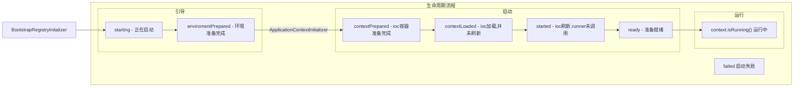

# 02.Spring核心原理

## 1.Spring生命周期



### 1.1.引导

利用BootstrapContext 引导整个项目启动

#### starting

应用开始，SpringApplication方法一调用，只要有了BootstrapContext就执行

#### enviromentPrepared

环境准备好（把启动参数等绑定到环境变量中），但是ioc还没有创建【调一次】

### 1.2.启动

#### contextPrepared

ioc容器创建并准备好，但是sources（主配置类）没加载。并关闭引导上下文,，组件都没创建【调一次】

#### contextLoaded

ioc容器加载，主配置类加载进去了。但是ioc容器还没刷新（我们的bean没创建）。

> 截止以前，ioc容器里面还没造bean

#### started

ioc容器刷新了（所有的bean造好了），但是runner没调用

#### ready

ioc容器刷新了（所有bean造好了），所有runner调用完成

### 1.3.运行

之前步骤都正确执行，代表容器running。

### 1.4.失败

#### failed

启动失败，感知`enviromentPrepared`、`contextPrepared`、`contextLoaded`、`started`、`ready`、`running`

## 2.事件触发时机

### 2.1.各种回调监听器

#### BootstrapRegistryInitalizer：引导初始化

感知特定阶段：引导初始化

创建引导上下文`bootStrapContext`的时候触发

##### 使用

1. `META-INF/spring.factories`；
2. `@Bean`或`@EventListener`：事件驱动；
3. SpringApplication.addBootstrapRegistryInitializer()。

##### 场景

1. 进行密钥校对授权

#### ApplicationContextInitialzer：ioc容器初始化

##### 使用

1. `META-INF/spring.factories`
2. `SpringApplication.addInitializers()`

#### ApplicationListener：基于事件机制

感知全阶段：基于事件机制，感知事件，一旦到哪个阶段可以做别的事

##### 使用

1. `@Bean`或`@EventListener`：事件驱动

2. `SpringApplication.addListeners(...)`或`SpringApplicationBuilder.listeners(...)`
3. `META-INF/spring.factories`

环绕感知，到哪个阶段可以做别的事

#### SpringApplicationRunListener

感知全阶段：生命周期 + 各种阶段都能自定义操作；功能完善。

##### 使用

1. `META-INFO/spring.factories`

#### ApplicationRunner

感知特定阶段：感知应用就绪Ready。卡死应用，就不会就绪

##### 使用

1. `@Bean`

#### CommandLineRunner

感知特定阶段：感知应用就绪Ready。卡死应用，就不会就绪

##### 使用

1. `@Bean`

### 2.2.完整触发流程

9中事件，触发顺序&时机

1. **ApplicationStartingEvent**：应用启动但未做任何事情，除过注册listeners and initializers；
2. **ApplicationEnvironmentPreparedEvent**：Environment准备好，但context未创建；

3. **ApplicationContextInitializedEvent**：ApplicationContext准备好，ApplicationContextInitializers调用，但是任何bean未加载；

4. **ApplicationPrepareEvent**：同期刷新之前，bean定义信息加载；

5. **ApplicationStartedEvent**：容器刷新完成，runner未调用；

   ===========以下就开始插入了探针机制===========

6. **AvailabilityChangeEvent**：LivenessState.CORREC应用存货；**存活探针**
7. **ApplicationReadyEvent**：任何runner被调用；
8. **AvailabilityChangeEvent**：ReadinessState.ACCEPTING_TRAFFIC **就绪探针**，可以接受请求；
9. **ApplicationFailedEvent**：启动出错。


感知应用是否**存活**了：植物状态。

应用是否**就绪**了：能响应请求。

#### 使用场景

1. 如果项目启动前做事：`BootstrapRegistryInitializer` 和 `ApplicationContextInitializer`
2. 如果想要在项目启动完成后做事：`ApplicaionRunner` 和 `CommandLineRunner`
3. 如果要干涉生命周期做事：`SpringApplicationRunListener`
4. 如果想要用事件机制：`ApplicationListener`

## 3.自动配置原理

应用关注的三大核心：场景、配置、组件

### 3.1.自动配置流程

1. 导入`starter`
2. 依赖导入`autoconfigure`
3. 寻找类路径下`META-INF/spring/org.springframework.boot.autocofigure.AutoConfiguration.imports`文件
4. 启动，加载所有`自动配置类` `xxxAutoConfiguration`
   1. 给容器中配置功能组件
   2. **组件参数**绑定到**属性类**中
   3. **属性类** 和 **配置文件** 前缀项绑定
   4. `@Contional` 诞生的条件注解，进行判断 **是否组件生效**
5. 效果
   1. 修改配置文件，修改底层参数
   2. 所有场景自动配置好直接使用
   3. 可以注入SpringBoot配置好的组件随时使用

### 3.2.SPI机制

Java中SPI（Srevice Provider Interface）是一种软件设计模式，用于**在应用程序中动态地发现和加载组件**，**SPI的思想**是，定义一个接口或抽象类，然后通过classpath中定义实现该接口的类来实现对组件的动态发现和加载。

SPI的主要目的是解决在应用程序中使用可插拔组件的问题，例如，一个应用程序可能需要使用不同的日志框架或数据库连接池，但是这些组件的选择可能取决于运行时的条件。通过使用SPI，应用程序可以在运行时发现并加载适当的组件，而无需再代码中硬编码这些组件的实现类。

在Java中，SPI的实现方法使用过META-INF/services目录下创建一个以服务接口全限定名为名字的文件，文件中包含实现该服务接口的类的全限定名。当应用程序启动时，Java的SPI机制会自动扫描classpath中这些文件，并根据文件中指定的类名加载实现类。

通过使用SPI，应用程序可以更灵活、可拓展的架构，同事也可以避免硬编码依赖关系和增加代码的可维护性。

> 在SpringBoot中，`META-INF/spring/org.springframework.boot.autoconfig.AutoConfiguration.imports`

### 3.3.功能开关

- 自动配置：全部都配置好，什么都不用管。自动批量导入
  - 项目一启动，SPI文件中指定的所有都加载
- `@EnableXXX`：手动控制那些功能开启。手动导入
  - 开启XXX功能
  - 都是利用 `@Import` 把功能要用的组件导入进去

> @EnableWebMvc // 全面接管SpringMvc，禁用所有mvc底层的自动配置
>
> @EnableAsync // 开启异步
>
> @EnableScheduling // 开启定时任务

## 4.进阶理解

### 4.1.@SpringBootApplication

```java
@EnableAutoConfiguration
@ComponentScan(excludeFilters = { @Filter(type = FilterType.CUSTOM, classes = TypeExcludeFilter.class),
		@Filter(type = FilterType.CUSTOM, classes = AutoConfigurationExcludeFilter.class) })
```

#### @SpringBootConfiguration

就是：@Configuration，容器中的组件，配置类，spring ioc启动就会加载创建这个类对象

#### @EnableAutoConfiguration：开启自动配置

开启自动配置

##### @AutoConfigurationPackage：扫描主程序包 - 加载自己的组件

- 利用 `@Import(AutoConfigurationImportSelector.class)`想要给容器中导入组件
- 把组程序所在的包的所有组件导入进来
- 为什么SpringBoot默认只扫描主程序所在的包及其子包

##### @Import(AutoConfigurationImportSelector.class)：加载所有自动配置类 - 加载starter导入的组件

```java
  List<String> configurations = ImportCandidates.load(AutoConfiguration.class, getBeanClassLoader())
			.getCandidates();
```

> 扫描SPI文件：`META-INF/spring/org.springframework.boot.autoconfigure.AutoConfiguration.imports`

#### @ComponentScan

组件扫描：排除一这些组件（哪些不要），排除前面已经扫描进来的`配置类`、和`自动配置类`。

```java
@ComponentScan(excludeFilters = { @Filter(type = FilterType.CUSTOM, classes = TypeExcludeFilter.class),
		@Filter(type = FilterType.CUSTOM, classes = AutoConfigurationExcludeFilter.class) })
```

## 5.生命周期启动加载机制


## 6.自定义starter

### 场景

抽取聊天机器人场景，它可以打招呼

### 效果

任何项目导入此 `starter` 都具有打招呼功能，并且问侯语中的人名需要可以在配置文件中修改；

### 步骤

1. 创建自定义starter项目，引入`spring-boot-starter`基础依赖
2. 编写模块功能，引入模块所需要的依赖。编写 `xxxAutoConfiguration` 自动配置类
3. 编写配置文件 `META-INFO/spring/org.springframework.boot.autoconfigure.AutoConfiguration.imports` 指定启动需要加载的自动配置
4. 其他项目引入即可使用

### 业务代码

#### 自定义业务配置有提示 

```xml
<!-- 导入配置处理器，配置文件自定义的properties配置都会有提示 -->
<dependency>
    <groupId>org.springframework.boot</groupId>
    <artifactId>spring-boot-configuration-processor</artifactId>
    <optional>true</optional>
</dependency>
```

```java
@Data
@Component
@ConfigurationProperties(value = "robot")
public class RobotProperties {

    private String name;

    private String hello;

    private int age;

}
```

### 生效方式

#### 基本抽取

- 创建starter项目，把公共代码需要的所有依赖导入
- 把公共代码复制进来
- 自己写一个`RobotAutoconfiguration`，给容器中导入这个场景需要的所有组件
  - 为什么这些组件默认不会扫描进去
  - starter所在的包和引入它的项目的主程序所在的包不是父子层级

- 别人引用这个`starter`，直接导入这个`RootAutoConfiguration`，就能把这个场景的组件导入进来
- 功能生效
- 测试编写配置文件

#### 使用Enable抽取

`RobotConfiguration.java`

```java
@Import(value = {RobotConfiguration.class,RobotProperties.class})
@Configuration
public class RobotConfiguration {
}
```

`EnableAutoConfiguration.java`

```java
@Target(ElementType.TYPE)
@Retention(RetentionPolicy.RUNTIME)
@Documented
@Import(RobotConfiguration.class)
public @interface EnableAutoConfiguration {

}
```

别人引入 `starter` 需要使用 `@EnableRobot` 开启功能

#### 完全自动

- 依赖SpringBoot的SPI机制
- `META-INF/spring/org.springframework.boot.autoconfigure.AutoConfiguration.imports`

`org.springframework.boot.autoconfigure.AutoConfiguration.imports`

```
xxx.RobotConfiguration
```

