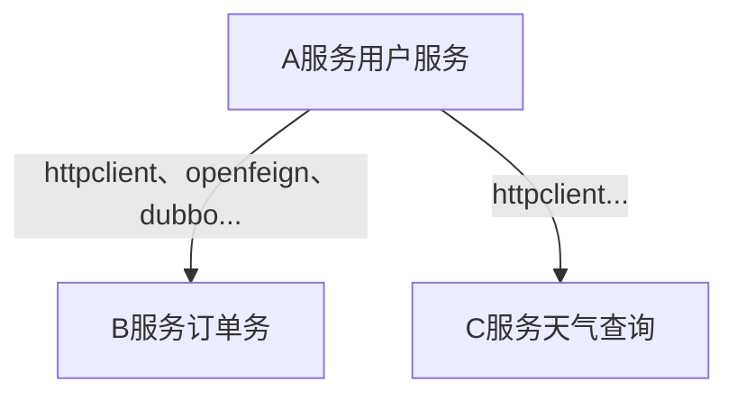
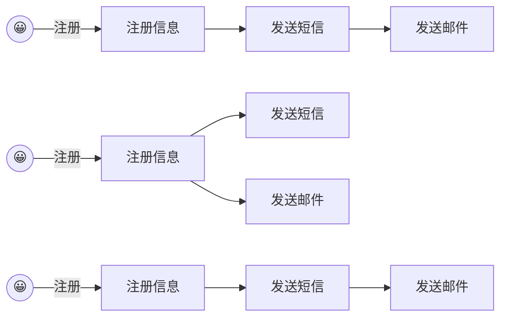
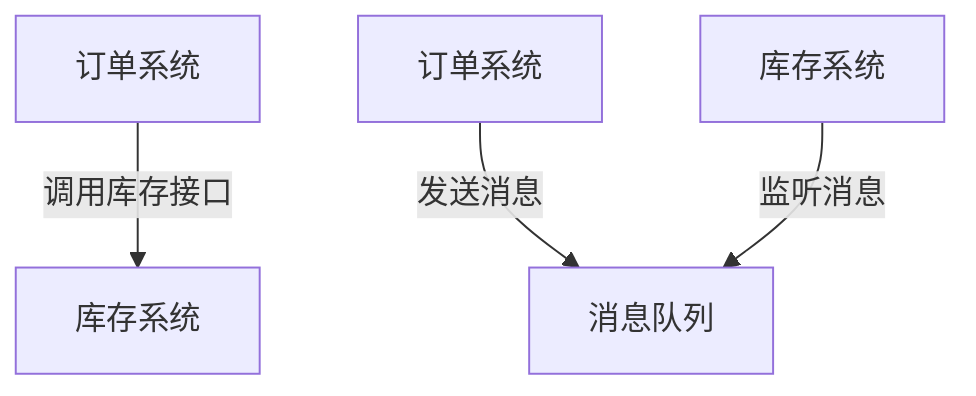
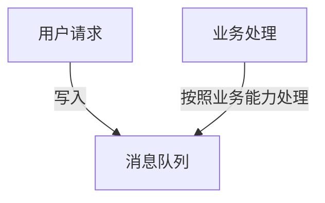
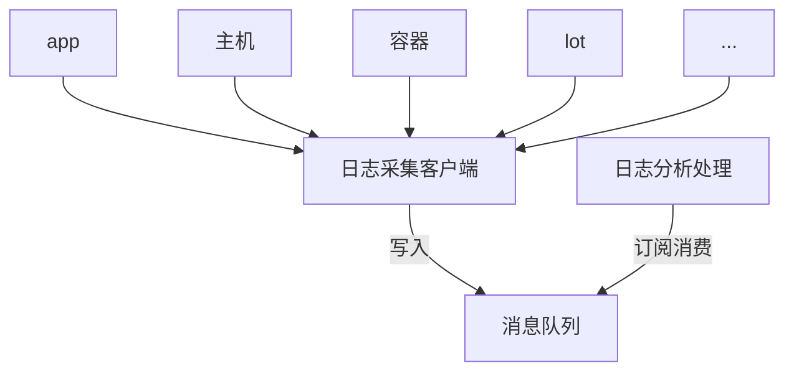
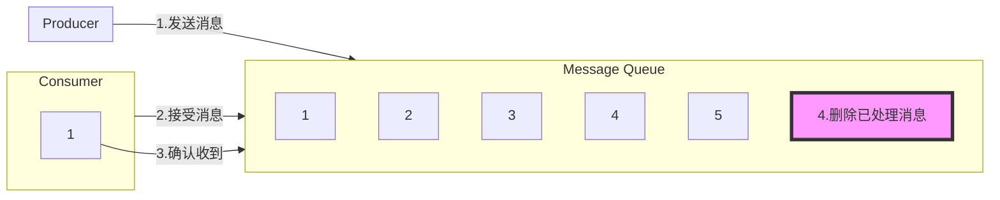
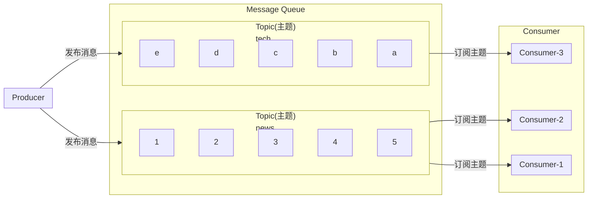
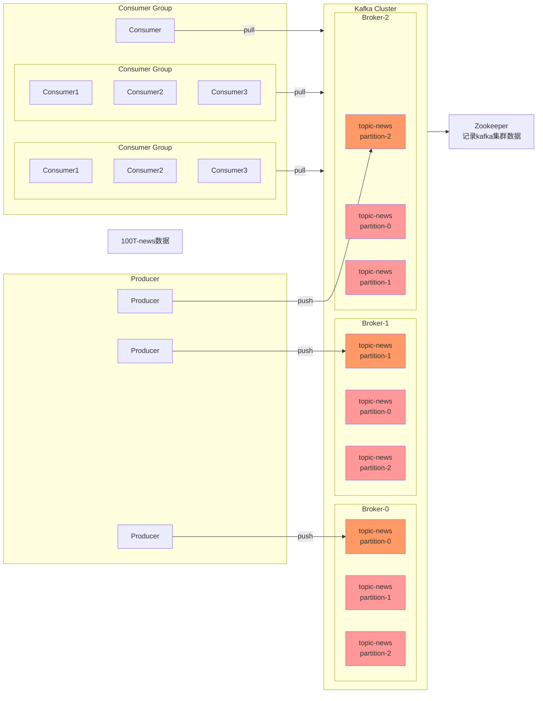

# 03.整合场景

## 1.前期准备

### 1.1.批量安装软件

在docker中安装`redis`、`prometheus`、`kafka`、`grafana`、`mysql`

`docker-compose.yml`

```yml
version: '3.9'

services:
  redis:
    image: redis:latest
    container_name: redis
    restart: always
    ports:
      - "6379:6379"
    networks:
      - backend

  zookeeper:
    image: bitnami/zookeeper:latest
    container_name: zookeeper
    restart: always
    environment:
      ZOOKEEPER_CLIENT_PORT: 2181
      ZOOKEEPER_TICK_TIME: 2000
      ALLOW_ANONYMOUS_LOGIN: yes
    networks:
      - backend

  kafka:
    image: bitnami/kafka:3.4.0
    container_name: kafka
    restart: always
    depends_on:
      - zookeeper
    ports:
      - "9092:9092"
    environment:
      ALLOW_PLAINTEXT_LISTENER: yes
      KAFKA_CFG_ZOOKEEPER_CONNECT: zookeeper:2181
      KAFKA_OFFSETS_TOPIC_REPLICATION_FACTOR: 1
    networks:
      - backend
  
  kafka-ui:
    image: provectuslabs/kafka-ui:latest
    container_name:  kafka-ui
    restart: always
    depends_on:
      - kafka
    ports:
      - "8080:8080"
    environment:
      KAFKA_CLUSTERS_0_NAME: dev
      KAFKA_CLUSTERS_0_BOOTSTRAPSERVERS: kafka:9092
    networks:
      - backend

  prometheus:
    image: prom/prometheus:latest
    container_name: prometheus
    restart: always
    volumes:
      - ./prometheus.yml:/etc/prometheus/prometheus.yml
    ports:
      - "9090:9090"
    networks:
      - backend

  grafana:
    image: grafana/grafana:latest
    container_name: grafana
    restart: always
    depends_on:
      - prometheus
    ports:
      - "3000:3000"
    networks:
      - backend

networks:
  backend:
    name: backend
```

`prometheus.yml`

```yaml
global:
  scrape_interval: 15s
  evaluation_interval: 15s

scrape_configs:
  - job_name: 'prometheus'
    static_configs:
      - targets: ['localhost:9090']

  - job_name: 'redis'
    static_configs:
      - targets: ['redis:6379']

  - job_name: 'kafka'
    static_configs:
      - targets: ['kafka:9092']
```

### 1.2.访问测试

#### WEB-UI

[kafka-ui](http://localhost:8080/)

[Grafana](http://localhost:3000/login)

[Prometheus](http://localhost:9090/)

#### GUI

[redis客户端](https://github.com/RedisInsight/RedisInsight)

## 2.整合

### 2.1.NoSQL

> 整合redis

### 2.2.接口文档

> sawgger

### 2.3.远程调用

RPC（Remote Procedure Call）：远程过程调用



本地过程调用：`a();b();a(){ b(); }; ` 不同方法都在一个JVM运行

远程过程调用：

- 服务提供者
- 服务消费者
- 通过连接对方服务器进行请求/响应交互，来实现调用效果


> 开发过程中，我们经常需要调用别人的功能
>
> - 如果事内部微服务，可以通过cloud、注册中兴、openfeign等进行调用
> - 如果是外部暴露的，可以发送http请求、或遵循外部协议进行调用
>
> SpringBoot整合提供了很多方式进行远程调用
>
> - 轻量级客户端方式
>   - RestTemplate：普通开发
>   - WebClient：响应式编程开发 `http-client`
>   - Http Interface：声明式编程 `spring-boot-starter-webflux-3.1.0`
>
> - Spring Cloud分布式解决方案
>   - Spring Cloud OpenFeign
> - 第三方框架
>   - Dubbo
>   - gRPC
>   - ...

API/SDK的区别是什么？

- api：接口（Application Progranmming Interface）
  - 远程提供功能
- sdk：工具包（Software Development Kit）
  - 导入jar包，直接调用功能即可

### 2.4.消息服务

#### 消息队列-场景

##### 1.异步

###### 场景1




##### 2.解耦

###### 场景2



##### 3.削峰

###### 场景3




##### 4.缓冲

###### 场景4




#### 消息队列-kafka

##### 消息模式

###### 点对点模式




###### 发布订阅模式



##### 原理

**分区（broker）**：海量数据分散存储

**副本**：每个数据区都有备份

> 同一个消费组里面的消费者是队列竞争模式
>
> 不同消费者组里面的消费者是发布/订阅模式



##### spring-boot整合

[地址](https://www.bilibili.com/video/BV1Es4y1q7Bf/?p=77&spm_id_from=pageDriver&vd_source=5130b9290d02c548b42330a7df26470d)

 
