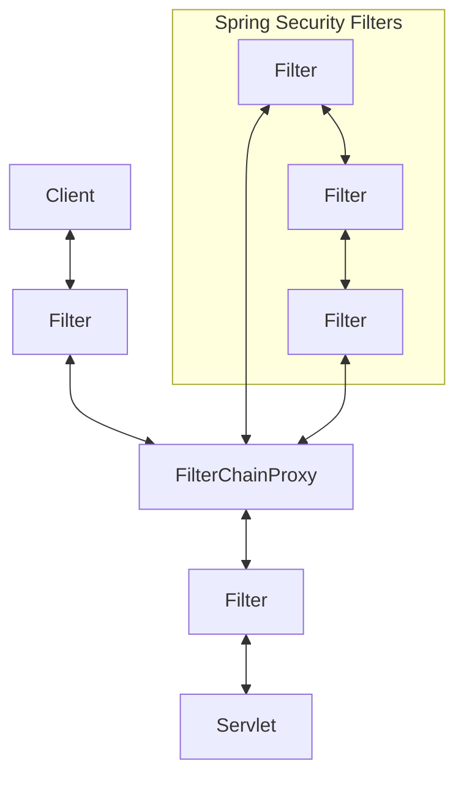
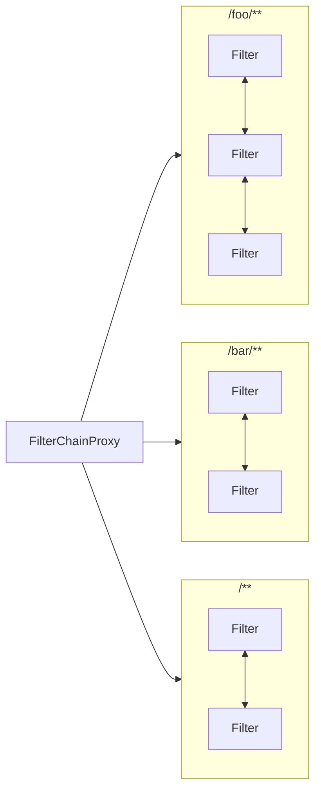
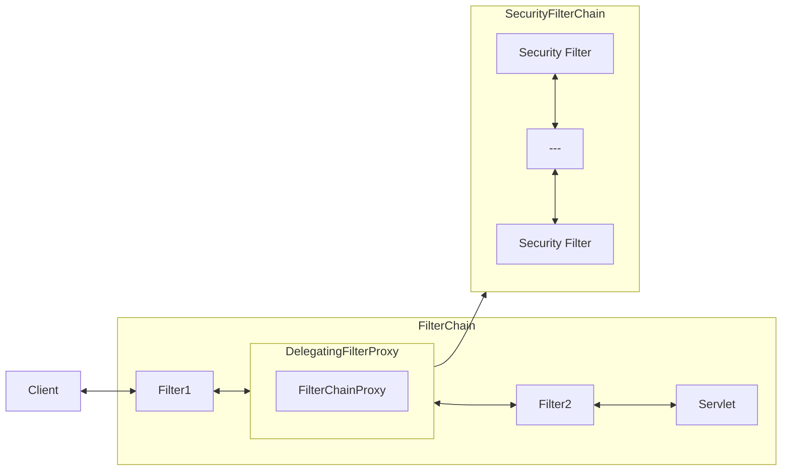

# 04.Web安全（Spring Security）

- Apache Shiro
- Spring Security

## 1.安全构架

### 1.1.认证：Authentication

>  你是谁（who are you?）

登录系统，用户系统

### 1.2.授权：Authorization

>  what are your allowed to do?

权限管理，用户授权

### 1.3.攻击防护

- XSS
- CSRF
- CORS
- SQL注入
- ...

## 2.扩展：权限模型

### 2.1.RBAC(Role Based Access Contoll)

- 用户(t_user)
- 角色(t_role)
- 权限(t_permission)

### 2.2.ACL

> 直接用户和权限挂钩

- 用户(t_user)
- 权限(t_permission)

## 3.原理

### 3.1.过滤器链架构

> Spring Security利用FilterChainProxy封装一系列拦截器链，实现各种安全拦截功能
>
> servlet三大组件：Servlet、Filter、Listener



### 3.2.FilterChainProxy



 

### 3.3.SecurityFilterChain



## 4.使用

### 4.1.HttpSecurity

```java
@Configration
@Order(SecurityProperties.BASE_AUTH_ORDER - 10)
public class ApplicationConfigureAdapter extends WebSecurityConfigureAdapter {
    @Overrride
    protected void configure(HttpSecurity http) throw Exception {
        http.antMatcher("/match1/**").
            authorizeRequests().
            antMatchers("/match1/user").hasRole("USER").
            anyRequest().isAuthenticated();
    }
}
```

### 4.2.MethodSecurity

####  核心

##### WebSecurityConfigurerAdapter

- @EnableGlobalMethodSecutity：开启全局方法安全配置
  - @Secured
  - @PreAuthorize
  - @PostAuthorize

- UserDetatilService：去数据库查询用户详情信息service（用户基本信息、用户角色、用户权限）

## 5.实战

[网页](https://www.bilibili.com/video/BV1Es4y1q7Bf?p=81&spm_id_from=pageDriver&vd_source=5130b9290d02c548b42330a7df26470d)

