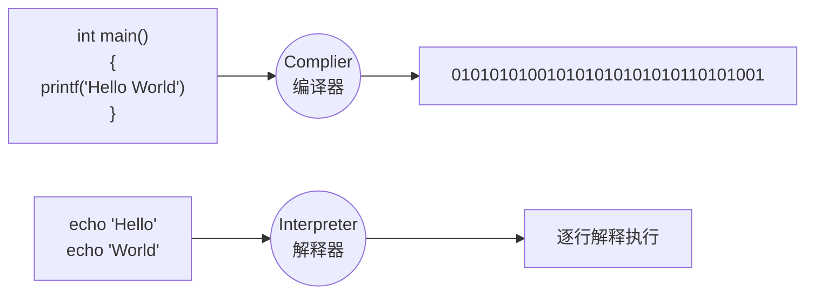
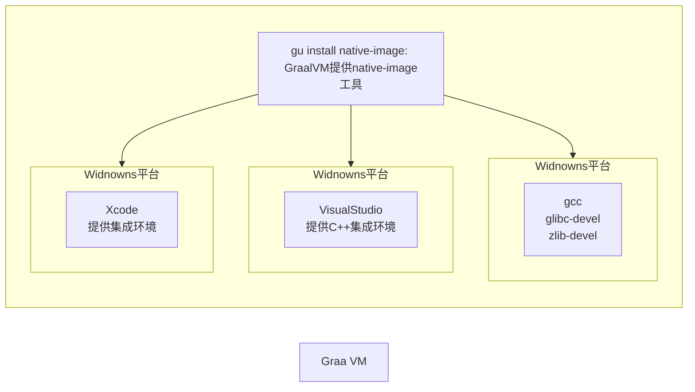

# 06.AOT

## 1.AOT与JIT

AOT：Ahead-of-Time（提前编译）：程序执行前，全部被编译成机器码

JIT：Just in Time（即时编译），程序边编译，边运行

编译：


### 1.1.Complier 与 Interpreter



| 对比项                 | **编译器**                                         | **解释器**                                               |
| ---------------------- | -------------------------------------------------- | -------------------------------------------------------- |
| **机器执行速度**       | **快**，因为源代码只需被转换一次                   | **慢**，因为每行代码都需要被解释执行                     |
| **开发效率**           | **慢**，因为需要耗费大量时间编译                   | **快**，无需花费时间生成目标代码，更快的开发和测试       |
| **调试**               | **难以调试**编译器生成的目标代码                   | **容易调试**源代码，因为解释器一行一行地执行             |
| **可移植性（跨平台）** | 不同平台需要重新编译目标平台代码                   | 同一份源码可以跨平台执行，因为每个平台会开发对应的解释器 |
| **学习难度**           | 相对较高，需要了解源代码、编译器以及目标机器的知识 | 相对较低，无需了解机器的细节                             |
| **错误检查**           | 编译器可以在编译代码时检查错误                     | 解释器只能在执行代码时检查错误                           |
| **运行时增强**         | 无                                                 | 可以**动态增强**                                         |

### 1.2.AOT 与 JIT 对比

| JIT                                                          | AOT                                                          |
| ------------------------------------------------------------ | ------------------------------------------------------------ |
| 1.具备**实时调整**能力 2.生成**最优机器指令** 3.根据代码运行情况**优化内存占用** | 1.速度快，优化了运行时编译时间和内存消耗 2.程序初期就能达最高性能 3.加快程序启动速度 |
| 1.运行期边编译**速度慢** 2.初始编译不能达到**最高性能**      | 1.程序第一次编译占用时间长 2.牺牲**高级语言**一些特性        |

在 OpenJDK 的官方 Wiki 上，介绍了HotSpot 虚拟机一个相对比较全面的、**即时编译器（JIT）**中采用的[优化技术列表](https://xie.infoq.cn/link?target=https%3A%2F%2Fwiki.openjdk.java.net%2Fdisplay%2FHotSpot%2FPerformanceTacticIndex)。

### 1.3.Java架构

### 1.4.Java的执行过程

### 1.5.JVM编译器

### 1.6.分层编译

  云原生：Cloud Native；Java小改版；

存在的问题：

- java应用如果用jar，解释执行，热点代码才编译成机器码，初始启动速度慢，初始处理请求数量少。
- 大型云平台，要求每一种应用都必须秒级启动，每个应用都要求效率高。

希望的效果：

- java应用也能提前被编译成机器码，随时急速启动，一启动就急速运行，最高性能
- 编译成机器码的好处：
  - 宁外服务器还需要安装java环境
  - 编译成机器码的，可以在这个平台windowns X64 直接运行。

原生镜像：native-image（机器码、本地镜像）

- 把应用打包成能适配本机平台的可执行文件（机器码、本地镜像）

## 2.GraalVM

https://www.graalvm.org/

> GraalVM是一个高性能的JDK，旨在加速用Java和其他JVM语言编写的应用程序的执行，同时还提供JavaScript、Python和许多其他流行语言的运行时。
>
> GraalVM提供了两种运行Java应用程序的方式：
>
> 1. 在HotSpotJVM上使用Graal即时（JIT）编译器
> 2. 作为预先编译（AOT）的本机可执行文件运行（本地镜像）
>
> GraalVM的多语言能力使得在单个应用程序中混合多种编程语言成为可能，同时消除了外部语言调用的脚本。

### 2.1.架构

### 2.2.安装



#### 2.2.1.Visual Studio

1. [下载 Visual Studio Tools - 免费安装 Windows、Mac、Linux (microsoft.com)](https://visualstudio.microsoft.com/zh-hans/downloads/)

2. **工作负荷**选择`使用C++的桌面开发`、`通用Windows平台开发`、**语言包**选择`英语`（中文会存在一些问题）

#### 2.2.2.graalvm

1. 下载

   https://github.com/graalvm/graalvm-ce-builds/releases

   > | Platform          | Java 11     | Java 17                                                      | Java 19    |                |
   > | ----------------- | ----------- | ------------------------------------------------------------ | ---------- | -------------- |
   > | Linux (amd64)     | ⬇️ download  | ⬇️ download                                                   | ⬇️ download | *instructions* |
   > | Linux (aarch64)   | ⬇️ download] | ⬇️ download                                                   | ⬇️ download | *instructions* |
   > | macOS (amd64) †   | ⬇️ download  | ⬇️ download                                                   | ⬇️ download | *instructions* |
   > | macOS (aarch64) † | ⬇️ download  | ⬇️ download                                                   |            |                |
   > | Windows (amd64)   | ⬇️ download  | [⬇️ download](https://github.com/graalvm/graalvm-ce-builds/releases/download/vm-22.3.1/graalvm-ce-java17-windows-amd64-22.3.1.zip) | ⬇️ download | *instructions* |
   >
   > https://github.com/graalvm/graalvm-ce-builds/releases/download/vm-22.3.1/native-image-installable-svm-java17-windows-amd64-22.3.1.jar

2. 修改环境变量

   > 指定graalvm环境变量替换原java环境变量

3. 安装native-image

   ```powershell
   gu -help
   
   gu install --file native-image-installable-svm-java17-windows-amd64-22.3.1.jar
   ~ Processing Component archive: native-image-installable-svm-java17-windows-amd64-22.3.1.jar
   Installing new component: Native Image (org.graalvm.native-image, version 22.3.1)
   
   native-image
   ~ Please specify options for native-image building or use --help for more info.
   ```

### 2.3.使用graalvm打包windowns平台本地镜像

#### 2.3.1.打包成jar

1. 修改jar包内的MANIFEST.MF文件，指定Main-Class的全类名

   > `MANIFEST.MF`
   >
   > ```
   > Manifest-Version: 1.0
   > Archiver-Version: Plexus Archiver
   > Created-By: Apache Maven 3.8.3
   > Built-By: Admin
   > Build-Jdk: 17.0.6
   > Main-Class: com.yukikyu.graalvm.demo.GraalvmMain
   > ```
   >


2. 运行

     ```powershell
     java -jar xx.jar
     ```

	>切换机器，安装java环境，默认解释执行，启动速度慢，运行速度慢

#### 2.3.2.编译原生镜像

1. 使用`native-tools`终端，在开始菜单中查找`x64 Native Tools Command Prompt for VS 2022`终端工具，关闭快速编辑模式；

   ```powershell
   native-image --help
   ```

2. 使用终端工具进入打包后的jar目录

3. 打包

   ```powershell
   native-image -cp graalvm-demo-1.0.0.jar com.yukikyu.graalvm.demo.GraalvmMain -o hello
   # 1. native-image -cp [jar包] [主程序包路径] -o [程序名]
   # 2. native-image -cp classes [主程序包路径] -o [程序名]
   hello.exe
   ```

### 2.4.使用graalvm打包linux平台本地镜像

#### 2.4.1.下载工具

```shell
# 远程下载工具
yum install -y lrzsz
```

#### 2.4.2.上传并解压graalvm包

#### 2.4.3.设置环境变量

```shell
sudo vim /etc/profile
~ ...
export JAVA_HOME=/usr/local/java/graalvm-ce-java17-22.3.2
export PATH=$PATH:$JAVA_HOME/bin

source /etc/profile
```

#### 2.4.4.打包

1. 安装native-image

   ```shell
   gu -help
   
   gu install --file native-image-installable-svm-java17-linux-amd64-22.3.2.jar
   ~ Processing Component archive: native-image-installable-svm-java17-linux-amd64-22.3.2.jar
   Installing new component: Native Image (org.graalvm.native-image, version 22.3.2)
   
   native-image
   ~ Please specify options for native-image building or use --help for more info.
   ```

   

2. 编译原生镜像

   ```shell
   # ubuntu下
   apt-get update
   apt-get install gcc -y
   apt-get install zlib1g zlib1g-dev
   
   native-image -cp graalvm-demo-1.0.0.jar com.yukikyu.graalvm.demo.GraalvmMain -o hello
   
   ./hello
   ```

> 1. 并不是所有的Java代码都能支持本地打包
>
> - 动态能力：反射的代码（动态获取构造器，反射创建对象，反射调用一些方法）
>
>   解决方案：额外处理（SpringBoot提供了一些注解）：提前告知graalvm反射回用到那些方法、构造器
>
> - 配置文件损失：
>
>   解决方案：额外处理（配置中心），提前告知graalvm配置文件怎么处理
>
> 2. 二进制里面不能包含的，不能动态的都得提前处理
>
> 3. 不是所有框架都适配了 AOT特性；spring全系列栈适配OK

###  2.5.打包springboot应用

1. [创建一个springboot应用](https://start.spring.io/#!type=maven-project&language=java&platformVersion=3.1.1&packaging=jar&jvmVersion=17&groupId=com.yukikyu&artifactId=aot-demo&name=aot-demo&description=Demo%20project%20for%20Spring%20Boot&packageName=com.yukikyu.aot.demo&dependencies=native,web)

2. 修改环境变量（必须）

   - Path

     ```
     D:\Microsoft Visual Studio\2022\Community\VC\Tools\MSVC\14.36.32532\bin\Hostx64\x64
     ```

   - INCLUDE

     ```
     D:\Microsoft Visual Studio\2022\Community\VC\Tools\MSVC\14.36.32532\include;C:\Program Files (x86)\Windows Kits\10\Include\10.0.22000.0\shared;C:\Program Files (x86)\Windows Kits\10\Include\10.0.22000.0\ucrt;C:\Program Files (x86)\Windows Kits\10\Include\10.0.22000.0\um;C:\Program Files (x86)\Windows Kits\10\Include\10.0.22000.0\winrt
     ```

   - lib

     ```
     D:\Microsoft Visual Studio\2022\Community\VC\Tools\MSVC\14.36.32532\lib\x64;C:\Program Files (x86)\Windows Kits\10\Lib\10.0.22000.0\um\x64;C:\Program Files (x86)\Windows Kits\10\Lib\10.0.22000.0\ucrt\x64
     ```

   > 注意修改自己对应的windows的路径

4. 修改pom.xml

   ```xml
   <plugin>
       <groupId>org.springframework.boot</groupId>
       <artifactId>spring-boot-maven-plugin</artifactId>
       <configuration>
           <mainClass>com.yukikyu.aot.demo.AotDemoApplication</mainClass>
       </configuration>
   </plugin>
   ```

   

3. 构建

   ```powershell
   mvn clean compile
   mvn spring-boot:process-aot
   ```

   使用`x64 Native Tools Command Prompt for VS 2022`终端

   ```powershell
   mvn native:build -f pom.xml
   ```

   > 查看本地环境的执行程序，在项目目录下的`\target\aot-demo.exe`，运行（控制台出现`%PARSER_ERROR[d] %PARSER_ERROR[p] 22252 --- [%PARSER_ERROR[t]] %PARSER_ERROR[logger]`可以不管）

### 2.6.使用-P激活native

```powershell
mvn -Pnative native:build -f pom.xml
```

> 执行exe程序，发现控制台日志输出正常

