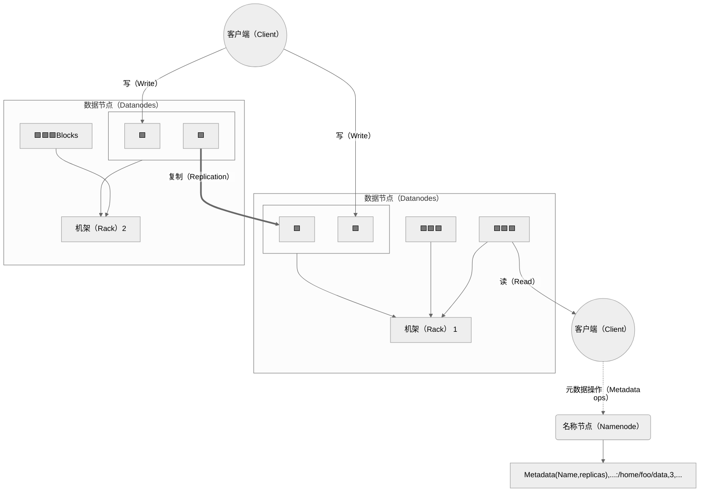
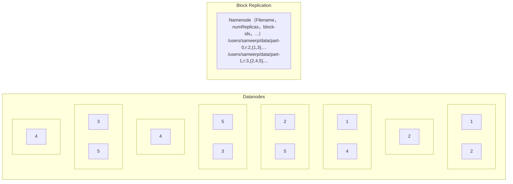

# 02.Hadoop Distributed File System（HDFS）

## 1.简介

HDFS是Hadoop的核心组件之一，用于存储和管理大规模数据集。下面是关于HDFS的基本概念的概述：

### 块存储

HDFS将大文件切分为固定大小的数据库（通常为64MB或128MB），并将这些块分散存储在集群中的多个数据节点上。每个数据块都有多个副本，默认情况下通常有3个副本。这数据块的分布式方式有助于提高数据的可靠性和容错性。

### NameNode和DataNode

#### NameNode

NameNode是HDFS的主节点，负责管理文件系统的命名空间和元数据。它维护了整个文件系统的目录结构、文件和块的映射关系等元数据信息。

NameNode也负责协调客户端的文件访问请求，并将数据块的位置信息提供给客户端。

#### DataNode

DataNode是HDFS的数据节点，负责存储实际的数据块。数据节点根据NameNode的指示存储数据块，并在需要时提供数据块的读取和写入服务。

DataNode还会向NameNode报告自身的健康状态和存储容量信息。

### 数据复制（Block Replication）

HDFS通过在集群中的多个数据节点上存储数据块的多个副本来提供数据冗余和容错性。这些副本通常分布在不同机架上，以防止机器级别的故障导致数据丢失。数据节点之间通过心跳机制和块报告来进行通信和数据同步。

### 容错性和自动恢复

HDFS具有高度的容错性。当某个数据节点发生故障或数据块损坏时，HDFS会自动复制丢失的数据块或损坏的副本。此外，当NameNode发生故障时，HDFS支持使用Secondary NameNode来进行元数据备份和恢复。

### 通信协议

所有 HDFS 通信协议都位于 TCP/IP 协议之上。客户端与 NameNode 计算机上的可配置TCP端口建立连接。它与 NameNode 对话 ClientProtocol。DataNode 使用 DataNode 协议与 NameNode 通信。远程过程调用 ( RPC ) 抽象包装了客户端协议和数据节点协议。根据设计，NameNode 从不发起任何 RPC。相反，它只响应 DataNode 或客户端发出的 RPC 请求。

## 2.安装
